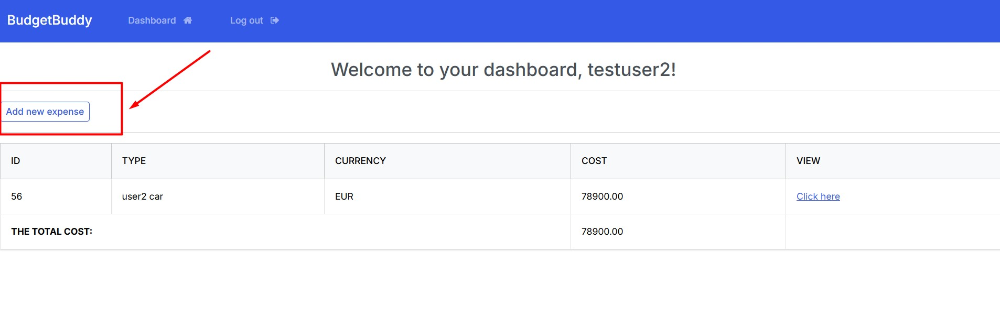

# BudgetBuddy Expense App

Link to the deployed project: https://budget--buddy-9063ab813672.herokuapp.com/ 

# Purpose of this project

Many people have troubles when it comes to money spending and checking where did the money go. So, its difficult to understand how much money spent during a certain period of time. BudgetBuddy money tracking app will help the customer to organize their finances in a proper way, help them track their expenses and organize their finances.

# Target Audience
The primary target audience includes business people, and anyone, looking for optimizing and tracking of their monthly budget.  

# User experience /  User Stories
As a user, I want to be able to:
- Add a new expense in my account, and track them. [UserStory1](<https://github.com/users/Borys-777/projects/8/views/1?pane=issue&itemId=90613153&issue=Borys-777%7CBudgetBuddy%7C9>)
- Edit an existing expense item so I can have the most recent updated records.  [UserStory2](<https://github.com/users/Borys-777/projects/8/views/1?pane=issue&itemId=90613485&issue=Borys-777%7CBudgetBuddy%7C10>)
- Have the functionality in the app to stop me from submitting a cost with incomplete or incorrect information.  [UserStory3](<https://github.com/users/Borys-777/projects/8/views/1?pane=issue&itemId=90614152&issue=Borys-777%7CBudgetBuddy%7C11>)
- See the total amount of all my expenses so that I can understand my total spent.     [UserStory4](<https://github.com/users/Borys-777/projects/8/views/1?pane=issue&itemId=90614236&issue=Borys-777%7CBudgetBuddy%7C12>)
- Have the functionality in the app so it can save my expense items in my account so that I can get back to them later, when needed.     [UserStory5](<https://github.com/users/Borys-777/projects/8/views/1?pane=issue&itemId=90614659&issue=Borys-777%7CBudgetBuddy%7C13>)
- Delete expense items, that are no longer needed / important for me.    [UserStory6](<https://github.com/users/Borys-777/projects/8/views/1?pane=issue&itemId=90614713&issue=Borys-777%7CBudgetBuddy%7C14>)
- Get notifications from the app when I login / logout from the account.    [UserStory7](<https://github.com/users/Borys-777/projects/8/views/1?pane=issue&itemId=90615055&issue=Borys-777%7CBudgetBuddy%7C15>)
- Get notifications from the app when I create, update, delete expense items in my account.       [UserStory8](<https://github.com/users/Borys-777/projects/8/views/1?pane=issue&itemId=90615482&issue=Borys-777%7CBudgetBuddy%7C16>)
- Have the functionality in the app so that only I have the access (and no one else) to my own records at any time.       [UserStory9](<https://github.com/users/Borys-777/projects/8/views/1?pane=issue&itemId=90615856&issue=Borys-777%7CBudgetBuddy%7C17>)
- Have an easy-to-navigate website, so I can understand the purpose of the website at a first glance and decide to use the app and create an account.         [UserStory10](<https://github.com/users/Borys-777/projects/8/views/1?pane=issue&itemId=90616284&issue=Borys-777%7CBudgetBuddy%7C18>)

# Agile methodology
Throughout this project, an Agile approach was taken in order to develop the app. User Stories have different acceptance criteria. The project board, as well as the User Stories can be found in the kanban board linked [here](<https://github.com/users/Borys-777/projects/8/views/1>). Using the Agile approach, with clear tasks and User stories helped a lot to complete the project successfully.

### User Interface, Experience and Feedback
This section shows how the user interacts with the app. If the app is user-friendly and easy-to-navigate.
It relates to: [User Story #10 - UX of the app and website] (As a User, I would like to have an easy-to-navigate website, so I can understand the purpose of the website at a first glance and decide to use the app and create an account) -[here](<https://github.com/users/Borys-777/projects/8/views/1?pane=issue&itemId=90616284&issue=Borys-777%7CBudgetBuddy%7C18>) 

# Features
The app consists of one main page with many features for the user.

## Add expenses
Adds a new expense to the list of expenses including the type of expense and cost.

## Edit expenses
Edit an existing expense either the expense name, amount or currency.

## Delete expenses
Delete an expense, the user is asked to confirm on a modal before deletion.

## Total cost overview
The total amount of all the expenses is displayed on the bottom of the list for transparency.

## User-Friendly Interface
The UI is user-friendly, simple and therefore easy to navigate.

## Secure authentication
Robust authentication measures were taken place to safely store each users private data.
Every user needs to authenticate themselves before accessing the features and data.
The authentication features include Sign In, Sign up and Sign out.
### Sign In

### Sign Up

### Sign Out

## Future features

Future features might include.

- Total cost that calculates all currencies together with consideration of their current exchange rates.

- Analytics that analyze a users spending habits over time to let them know where they could improve.

- Reminders for open payments or upcoming bills.

## Bug Fixes
- Bug: Two different users can't name their items the same.

  - Working solution: Remove 'unique=True' from the item field in the Model.

- Bug: User can't add an expense.
  - Working solution: Clean up forms file and add widgets.

Currently theres a bug where a white bar with a slash appears on top of the page.
I couldn't find the error for this just yet.

# Design
## Color

The app adopts a dark color scheme to provide contrast and ensure visibility against the background. This choice helps users quickly locate features and enhances overall usability.

## Typography
The app name stands out with a simple serif font in the navbar, and the 'page/form titles' stand out with 'Franklin Gothic Medium'.
Other than that the default font has been left.

# Wireframes
## Entity relationship diagram

## User interface

# Technology

## Languages

- HTML 5
- CSS 3
- JavaScript
- Django
- Python

## Django Packages

- Gunicorn: As the server for Heroku

- Dj_database_url: To parse the database URL from the environment variables in Heroku

- Psycopg2: As an adaptor for Python and DB

- Allauth: For authentication, registration and account management

- Crispy Forms: To style the forms

## Frameworks - Libraries - Programs Used

- Bootstrap: Was used to style the app

- Jquery: All the scripts were written using jquery library

- Git: Git was used for version control by utilizing the Gitpod terminal to commit to Git and push to GitHub

- GitHub: GitHub is used to store the project's code after being pushed from Git

- Heroku: Heroku was used to deploy the live project

- PostgreSQL: With ElephantSQL through Heroku

- Gitpod: Gitpod was used to create and edit the app

- Lucidchart: Lucidchart was used to create the database diagram

- PEP8: PEP8 was used to validate all the Python code

- W3C - HTML: W3C- HTML was used to validate all the HTML code

- W3C - CSS: W3C - CSS was used to validate the CSS code

- Google Chrome Dev Tools: To check App responsiveness and debugging

# Testing
The tests can be found [here](<https://github.com/Tekali7/Costly/blob/main/TESTS.md>)
### User Authentication and Authorization
This epic focuses on providing users with secure access to their accounts while restricting access to unauthorized users. By implementing user authentication, users can securely log in to their accounts using unique credentials, such as usernames and passwords. Additionally, user authorization ensures that authenticated users have appropriate permissions to access specific features and data within the app.

# Project Creation
## Creating the Django app

1. Go to the Code Institute Gitpod Full Template [Template](https://github.com/Code-Institute-Org/gitpod-full-template)
2. Click on Use This Template
3. Once the template is available in your repository click on Gitpod
4. When the image for the template and the Gitpod are ready open a new terminal to start a new Django App
5. Install Django and gunicorn: `pip3 install django gunicorn`
6. Install supporting database libraries dj_database_url and psycopg2 library: `pip3 install dj_database_url psycopg2`
7. Create file for requirements: in the terminal window type `pip freeze --local > requirements.txt`
8. Create project: in the terminal window type django-admin startproject your_project_name
9. Create app: in the terminal window type python3 manage.py startapp your_app_name
10. Add app to the list of installed apps in settings.py file: you_app_name
11. Migrate changes: in the terminal window type python3 manage.py migrate
12. Run the server to test if the app is installed, in the terminal window type python3 manage.py runserver
13. If the app has been installed correctly the window will display The install worked successfully! Congratulations!

## Deployment of This Project

* This site was deployed by completing the following steps:

1. Log in to [Heroku](https://id.heroku.com) or create an account
2. On the main page click the button labelled New in the top right corner and from the drop-down menu select Create New App
3. You must enter a unique app name
4. Next select your region
5. Click on the Create App button
6. Click in resources and select Heroku Postgres database
7. Click Reveal Config Vars and add a new record with SECRET_KEY
8. Click Reveal Config Vars and add a new record with the `CLOUDINARY_URL`
9. Click Reveal Config Vars and add a new record with the `DISABLE_COLLECTSTATIC = 1`
10. The next page is the project’s Deploy Tab. Click on the Settings Tab and scroll down to Config Vars
11. Next, scroll down to the Buildpack section click Add Buildpack select python and click Save Changes
12. Scroll to the top of the page and choose the Deploy tab
13. Select Github as the deployment method
14. Confirm you want to connect to GitHub
15. Search for the repository name and click the connect button
16. Scroll to the bottom of the deploy page and select the preferred deployment type
17. Click either Enable Automatic Deploys for automatic deployment when you push updates to Github or click Manual Deploys

## Final Deployment 

1. Create a runtime.txt `python-3.12.3`
2. Create a Procfile `web: gunicorn your_project_name.wsgi`
3. When development is complete change the debug setting to: `DEBUG = False` in settings.py
4. If you use the summernote editor add this for it to work on Heroku: `X_FRAME_OPTIONS = SAMEORIGIN ` to settings.py.
5. In Heroku settings, delete the config vars for `DISABLE_COLLECTSTATIC = 1`

## Forking This Project

* Fork this project by following the steps:

1. Open [GitHub](https://github.com/Tekali7/Costly)
2. Find the 'Fork' button at the top right of the page
3. Once you click the button the fork will be in your repository

## Cloning This Project

* Clone this project by following the steps:

1. Open [GitHub](https://github.com/Tekali7/Costly)
2. You will be provided with three options to choose from, HTTPS, SSH or GitHub CLI, click the clipboard icon in order to copy the URL
3. Once you click the button the fork will be in your repository
4. Open a new terminal
5. Change the current working directory to the location that you want the cloned directory
6. Type 'git clone' and paste the URL copied in step 3
7. Press 'Enter' and the project is cloned

# Credits

- The delete confirmation modal was adapted from the walkthrough project.
- The HTML for displaying Django messages was adapted from the walkthrough project.
- The 10 lines in the base template's main section were adapted from the walkthrough project.
- The header in the base template was adapted from the walkthrough project.

- I found a lot of information about Django's urls, forms, models etc on the [Django Documentation](<https://docs.djangoproject.com/en/5.0/>).
- My Mentor Brian Macharia taught me about aggregation, styling and authentication.

- The remainder of the code was written by me with the help from the mentioned Documentation and also [Stackoverflow](<https://stackoverflow.com/>) to solve problems.

