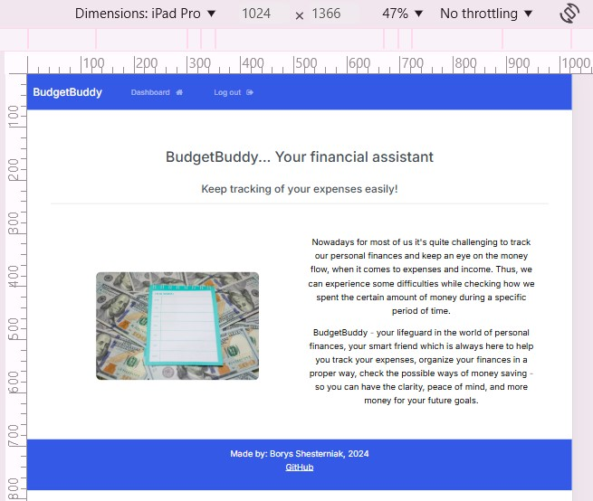
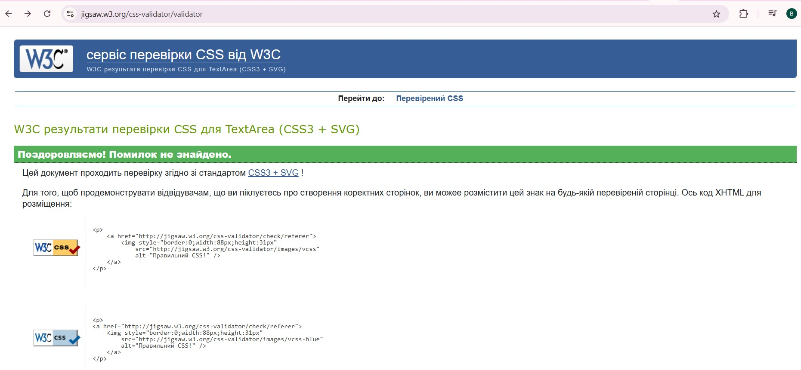

# BudgetBuddy Expense App

Link to the deployed project: https://budget--buddy-9063ab813672.herokuapp.com/ 

This project was completed as the final portfolio project for the Code Institute.
Made by Borys Shesterniak, December 2024.

# Database Planning

I used https://app.diagrams.net/ to create an ERD for my project. 

During the process I realized that I will not be able to complete the whole ERD, as planned at the beginning, due to the lack of time. 
I decided to pay attention to thre user and Expense model. And implement ExpenseType model in the next sprints.
I will indicate it in details in the section for the Future Features. 

# Purpose of this project

Many people have troubles when it comes to money spending and checking where did the money go. So, its difficult to understand how much money spent during a certain period of time. BudgetBuddy money tracking app will help the customer to organize their finances in a proper way, help them track their expenses and organize their finances.

# Target Audience
The primary target audience includes business people, and anyone, looking for optimizing and tracking of their monthly budget.  

# Wireframes
I used Balsamiq to create my wireframes (<https://balsamiq.cloud/sfqofub/pgj5zvp/rAA7E>). The final product looks a bit different from the original plans, although it was a great benefit to keep my project go properly and keep me on the track. The extended features may be implemened in the next sprints. 

# Agile methodology
Throughout this project, an Agile approach was taken in order to develop the app. User Stories have different acceptance criteria. The project board, as well as the User Stories can be found in the kanban board linked [here](<https://github.com/users/Borys-777/projects/8/views/1>). Kanban Board has these sections: ToDo, In Progress, Done, Could Do, Won't Do. Also, the labels: "Must Do, Should Do, Could Do, Won't Do" help to use the MoSCoW prioritization, while planning and executing of the tasks. Using the Agile approach, with clear tasks and User stories helped a lot to complete the project successfully.

# Task Management
The Kanban board not only tracked user stories but also functioned as a detailed task list. I used it to break down user stories into smaller, actionable tasks, providing clear and manageable development objectives. This approach allowed for better progress tracking and improved collaboration within the team.

# User experience /  User Stories
All the User Stories were mapped to the Kanban Board and you can see them here: 

As a user, I want to be able to:
- Add a new expense in my account, and track them. [UserStory1](<https://github.com/users/Borys-777/projects/8/views/1?pane=issue&itemId=90613153&issue=Borys-777%7CBudgetBuddy%7C9>)
- Edit an existing expense item so I can have the most recent updated records.  [UserStory2](<https://github.com/users/Borys-777/projects/8/views/1?pane=issue&itemId=90613485&issue=Borys-777%7CBudgetBuddy%7C10>)
- Have the functionality in the app to stop me from submitting a cost with incomplete or incorrect information.  [UserStory3](<https://github.com/users/Borys-777/projects/8/views/1?pane=issue&itemId=90614152&issue=Borys-777%7CBudgetBuddy%7C11>)
- See the total amount of all my expenses so that I can understand my total spent.     [UserStory4](<https://github.com/users/Borys-777/projects/8/views/1?pane=issue&itemId=90614236&issue=Borys-777%7CBudgetBuddy%7C12>)
- Have the functionality in the app so it can save my expense items in my account so that I can get back to them later, when needed.     [UserStory5](<https://github.com/users/Borys-777/projects/8/views/1?pane=issue&itemId=90614659&issue=Borys-777%7CBudgetBuddy%7C13>)
- Delete expense items, that are no longer needed / important for me.    [UserStory6](<https://github.com/users/Borys-777/projects/8/views/1?pane=issue&itemId=90614713&issue=Borys-777%7CBudgetBuddy%7C14>)
- Get notifications from the app when I login / logout from the account.    [UserStory7](<https://github.com/users/Borys-777/projects/8/views/1?pane=issue&itemId=90615055&issue=Borys-777%7CBudgetBuddy%7C15>)
- Get notifications from the app when I create, update, delete expense items in my account.       [UserStory8](<https://github.com/users/Borys-777/projects/8/views/1?pane=issue&itemId=90615482&issue=Borys-777%7CBudgetBuddy%7C16>)
- Have the functionality in the app so that only I have the access (and no one else) to my own records at any time.       [UserStory9](<https://github.com/users/Borys-777/projects/8/views/1?pane=issue&itemId=90615856&issue=Borys-777%7CBudgetBuddy%7C17>)
- Have an easy-to-navigate website, so I can understand the purpose of the website at a first glance and decide to use the app and create an account.         [UserStory10](<https://github.com/users/Borys-777/projects/8/views/1?pane=issue&itemId=90616284&issue=Borys-777%7CBudgetBuddy%7C18>)

### User Interface, Experience and Feedback
This section shows how the user interacts with the app. If the app is user-friendly and easy-to-navigate.
It relates to: [User Story #10 - UX of the app and website] (As a User, I would like to have an easy-to-navigate website, so I can understand the purpose of the website at a first glance and decide to use the app and create an account) -[here](<https://github.com/users/Borys-777/projects/8/views/1?pane=issue&itemId=90616284&issue=Borys-777%7CBudgetBuddy%7C18>) 

# Features 
The app consists of one main page with many features for the user.

## Add expense
Adds a new expense to the list of expenses including the type of expense and cost.

## Edit expense / record
Edit an existing expense (expense name, amount).

## Delete expenses
Delete an existing expense.

## Total cost overview
The total amount of all the expenses is shown at the bottom of all the expenses:

## User-Friendly Interface
The UI is user-friendly and easy to navigate for the user. The icons for Dashboard and Logout buttons provides additional functionality.

## Navbar 
The navigation bar with main buttons; Dashboard, Logout - for logged in users. And - Register, Login - for the new users, who idn't create the account yet. 

## Secure authentication
Robust authentication measures were taken place to safely store each users private data.
Every user needs to authenticate themselves and login to their account before accessing the features and data.
The authentication features include Register, Log in and Log out.
### Register

### Login

### Log Out

## Responsive Design:
The website is built to be responsive, ensuring a seamless user experience across different screen sizes. 
On smaller screens, the navbar collapses into a hamburger menu for easier navigation.

## Additional Security Features:
Users are redirected to the sign-in page if they attempt unauthorized actions. So unathorized users can not enter and manipulate other registered user's records. Unathorized users can not edit / delete the registered users' records, as such records are not visible for the unauthorized users. 

## Future features

Future features might include:

- The total cost shown in EUR:

- Adding a favicon to the page. As for now I didn't implement it, due to the lack of time (and concentrating mostly on the main functionality).

- Adding more currencies and converting them into 1 common currency, by using JS. 

- Adding Month model, for the user to set and check expenses for the specific months. 

- Adding an ExpenseType Model, so the user make categories for different expense types. 

- Analytics for the users spending habits over time - to show them the possible ways to improve and save money in the future.

# Technologies Used

- HTML 5
- CSS 3
- JavaScript
- Django
- Python
- Bootstrap 5 
- Balsamiq
- Font Awesome 
- GitHub 
- Git 
- Vecteezy
- Google Fonts
- Heroku 

# Testing and Validation
## Responsiveness

I used the dev tools on chrome to test the website for responsiveness. Here are the screenshots to demonstrate responsive design across different devices: mobile, tablet and laptop.
Navbar collapses to a burger bar on smaller screen sizes.
The pages of the website are responsive on different devices:

Dashboard:

Main page:

Register your account page:

# Testing and Validation
I used the W3 HTML Validator to check the HTML on each of my site pages by Direct Input. 

I have resolved the necessary errors. However there are some error messages remaning which are due to the content being created using Django. Mostly with  hashtag, which can't be defined as proper by HTML Validator.

 ## Base.html

## Create Record.html
 - the same errors with  and . HTML Validator can't recognize them and shows an error. 

## Dashboard.html
The same errors here, related to the 

## Index.html
The same errors here, related to the 

## My login 
The same errors here, related to the 

## Navbar
Similar errors, related to the  

## Read Record 
Similar errors, related to Django syntax, inheritance from base.html and  

## Register 
Similar errors, related to inheritance and Django syntax.

## Update record 
Similar errors, related to inheritance and Django syntax.

# CSS Validation 
I used the W3 CSS Validator to check my CSS script by Direct Input. There are no errors indicated.

## Python and Django
I used the CI Python Linter to check my python scripts. There are a few small errors like the below - mostly lines were too long or there was a missing blank space line / no newline at end of file. I have left some of the error messages as they are related to a too long line or as the result of a comment.

## Bug Fixes
- Bug: Two different users can't name their items the same.

  - Working solution: Remove 'unique=True' from the item field in the Model.

- Bug: User can't add an expense.
  - Working solution: Clean up forms file and add widgets.

Currently theres a bug where a white bar with a slash appears on top of the page.
I couldn't find the error for this just yet.

# Design
## Color

The app adopts a dark color scheme to provide contrast and ensure visibility against the background. This choice helps users quickly locate features and enhances overall usability.

## Typography
The app name stands out with a simple serif font in the navbar, and the 'page/form titles' stand out with 'Franklin Gothic Medium'.
Other than that the default font has been left.

# Wireframes
## Entity relationship diagram

## User interface

## Django Packages

- Gunicorn: As the server for Heroku

- Dj_database_url: To parse the database URL from the environment variables in Heroku

- Psycopg2: As an adaptor for Python and DB

- Allauth: For authentication, registration and account management

- Crispy Forms: To style the forms

## Frameworks - Libraries - Programs Used

- Bootstrap: Was used to style the app

- Jquery: All the scripts were written using jquery library

- Git: Git was used for version control by utilizing the Gitpod terminal to commit to Git and push to GitHub

- GitHub: GitHub is used to store the project's code after being pushed from Git

- Heroku: Heroku was used to deploy the live project

- PostgreSQL: With ElephantSQL through Heroku

- Gitpod: Gitpod was used to create and edit the app

- Lucidchart: Lucidchart was used to create the database diagram

- PEP8: PEP8 was used to validate all the Python code

- W3C - HTML: W3C- HTML was used to validate all the HTML code

- W3C - CSS: W3C - CSS was used to validate the CSS code

- Google Chrome Dev Tools: To check App responsiveness and debugging

# Testing
The tests can be found [here](<https://github.com/Tekali7/Costly/blob/main/TESTS.md>)
### User Authentication and Authorization
This epic focuses on providing users with secure access to their accounts while restricting access to unauthorized users. By implementing user authentication, users can securely log in to their accounts using unique credentials, such as usernames and passwords. Additionally, user authorization ensures that authenticated users have appropriate permissions to access specific features and data within the app.

# Project Creation
## Creating the Django app

1. Go to the Code Institute Gitpod Full Template [Template](https://github.com/Code-Institute-Org/gitpod-full-template)
2. Click on Use This Template
3. Once the template is available in your repository click on Gitpod
4. When the image for the template and the Gitpod are ready open a new terminal to start a new Django App
5. Install Django and gunicorn: `pip3 install django gunicorn`
6. Install supporting database libraries dj_database_url and psycopg2 library: `pip3 install dj_database_url psycopg2`
7. Create file for requirements: in the terminal window type `pip freeze --local > requirements.txt`
8. Create project: in the terminal window type django-admin startproject your_project_name
9. Create app: in the terminal window type python3 manage.py startapp your_app_name
10. Add app to the list of installed apps in settings.py file: you_app_name
11. Migrate changes: in the terminal window type python3 manage.py migrate
12. Run the server to test if the app is installed, in the terminal window type python3 manage.py runserver
13. If the app has been installed correctly the window will display The install worked successfully! Congratulations!

## Deployment of This Project

* This site was deployed by completing the following steps:

1. Log in to [Heroku](https://id.heroku.com) or create an account
2. On the main page click the button labelled New in the top right corner and from the drop-down menu select Create New App
3. You must enter a unique app name
4. Next select your region
5. Click on the Create App button
6. Click in resources and select Heroku Postgres database
7. Click Reveal Config Vars and add a new record with SECRET_KEY
8. Click Reveal Config Vars and add a new record with the `CLOUDINARY_URL`
9. Click Reveal Config Vars and add a new record with the `DISABLE_COLLECTSTATIC = 1`
10. The next page is the project’s Deploy Tab. Click on the Settings Tab and scroll down to Config Vars
11. Next, scroll down to the Buildpack section click Add Buildpack select python and click Save Changes
12. Scroll to the top of the page and choose the Deploy tab
13. Select Github as the deployment method
14. Confirm you want to connect to GitHub
15. Search for the repository name and click the connect button
16. Scroll to the bottom of the deploy page and select the preferred deployment type
17. Click either Enable Automatic Deploys for automatic deployment when you push updates to Github or click Manual Deploys

## Final Deployment 

1. Create a runtime.txt `python-3.12.3`
2. Create a Procfile `web: gunicorn your_project_name.wsgi`
3. When development is complete change the debug setting to: `DEBUG = False` in settings.py
4. If you use the summernote editor add this for it to work on Heroku: `X_FRAME_OPTIONS = SAMEORIGIN ` to settings.py.
5. In Heroku settings, delete the config vars for `DISABLE_COLLECTSTATIC = 1`

## Forking This Project

* Fork this project by following the steps:

1. Open [GitHub](https://github.com/Tekali7/Costly)
2. Find the 'Fork' button at the top right of the page
3. Once you click the button the fork will be in your repository

## Cloning This Project

* Clone this project by following the steps:

1. Open [GitHub](https://github.com/Tekali7/Costly)
2. You will be provided with three options to choose from, HTTPS, SSH or GitHub CLI, click the clipboard icon in order to copy the URL
3. Once you click the button the fork will be in your repository
4. Open a new terminal
5. Change the current working directory to the location that you want the cloned directory
6. Type 'git clone' and paste the URL copied in step 3
7. Press 'Enter' and the project is cloned

# Credits

- The layout of the page was used with the help of: https://bootswatch.com/
- Other projects where I took the inspiration, help and ideas: 
(<https://github.com/Stephen-Bevan/Magical-Maths-Monkey/tree/main>)  - our common Hackathon project 
(<https://github.com/Borys-777/ukrainians_in_ireland/tree/main >) - my previous project 
(<https://github.com/Tekali7/Costly/tree/main>), (<https://costly-413690edf851.herokuapp.com/>) - project from previous cohorts 
(<https://creating-database-14nov-c059f8c1f0b2.herokuapp.com/>) - Walkthrough Blog project 
(<https://github.com/Borys-777/django-blog-14-Nov/tree/main>) , (<https://creating-database-14nov-c059f8c1f0b2.herokuapp.com/bootstrap-bliss-simplifying-web-development-with-bootstrap/>) - my previous Walkthrough project
(<https://github.com/davidcalikes/mypse.ie>), (<https://mypse.herokuapp.com/>) - David's project
(<https://github.com/katiejanecoughlan/sojourn-scribbles-V3>) - Katie's project
(<https://github.com/cloud-with-django/Django-CRM-mastery-app-Project-1-YT/tree/main>) - similar project from Youtube 
 - LMS for teaching content: (<https://learn.codeinstitute.net/ci_program/fsbootcamp_with_hackathons_v2_2>)

- Bootstrap technologies: (<https://getbootstrap.com/docs/4.0/components/card/>)

- Youtube resources: (<https://www.youtube.com/watch?v=pqWyUAT38e0&t=7810s>), (<https://www.youtube.com/watch?v=sBjbty691eI&list=PLXuTq6OsqZjbCSfiLNb2f1FOs8viArjWy>), (<https://www.youtube.com/watch?v=hWhWdf2gsfQ&list=PL_SWATNcLmYmlMmEIb18iZldUEwAOONke>), (<https://www.youtube.com/watch?v=l6xIYIH87cI&list=PL0rhqMLHaq3C8qmw7LmEdinUfYXv4IxQc&index=2 >)

- Photos were used from this website: (<https://www.vecteezy.com/photo/4361569-financial-planning-of-the-work-week>), inspiration from these as well: (<https://www.vecteezy.com/photo/4361569-financial-planning-of-the-work-week>),  (<https://www.vecteezy.com/photo/28113098-photo-realistic-of-calculator-money-and-paper-with-graphic-chart-on-table-ai-generative>) , (<https://www.vecteezy.com/photo/28114675-photo-realistic-of-calculator-money-and-paper-with-graphic-chart-on-table-ai-generative>)

- The HTML for displaying Django messages was adapted from the walkthrough project.
- The 10 lines in the base template's main section were adapted from the walkthrough project.
- The header in the base template was adapted from the walkthrough project.

- I found a lot of information about Django's urls, forms, models etc on the [Django Documentation](<https://docs.djangoproject.com/en/5.0/>).
- My Mentor Brian Macharia taught me about aggregation, styling and authentication.

- The remainder of the code was written by me with the help from the mentioned Documentation and also [Stackoverflow](<https://stackoverflow.com/>) to solve problems.

