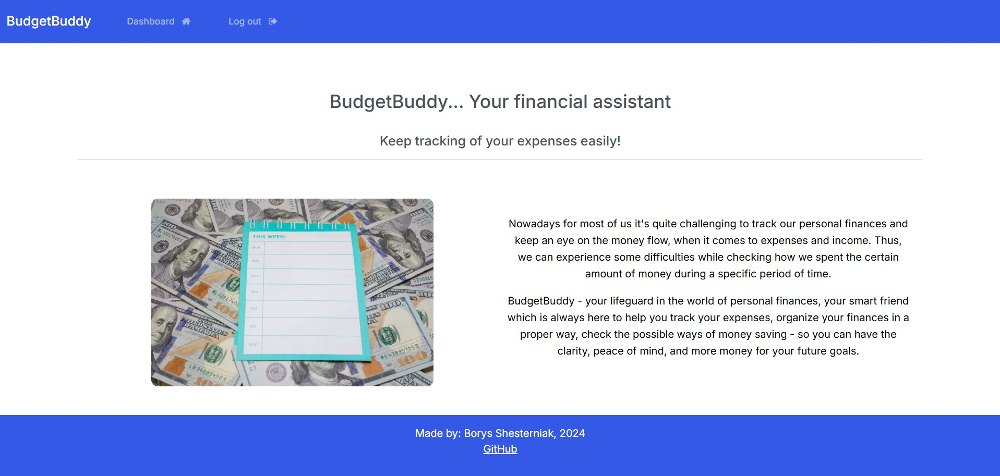
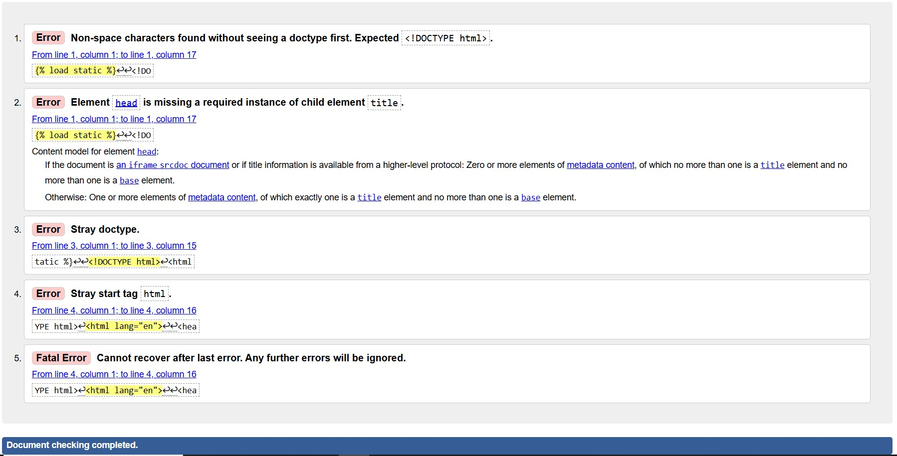

# BudgetBuddy Expense App

Link to the deployed project: https://budget--buddy-9063ab813672.herokuapp.com/ 

This project was completed as the final portfolio project for the Code Institute.
Made by Borys Shesterniak, December 2024.

# Database Planning

I used https://app.diagrams.net/ to create an ERD for my project. 

During the process I realized that I will not be able to complete the whole ERD, as planned at the beginning, due to the lack of time. 
I decided to pay attention to thre user and Expense model. And implement ExpenseType model in the next sprints.
I will indicate it in details in the section for the Future Features. 

# Purpose of this project

Many people have troubles when it comes to money spending and checking where did the money go. So, its difficult to understand how much money spent during a certain period of time. BudgetBuddy money tracking app will help the customer to organize their finances in a proper way, help them track their expenses and organize their finances.

# Target Audience
The primary target audience includes business people, and anyone, looking for optimizing and tracking of their monthly budget.  

# Wireframes
I used Balsamiq to create my wireframes (<https://balsamiq.cloud/sfqofub/pgj5zvp/rAA7E>). The final product looks a bit different from the original plans, although it was a great benefit to keep my project go properly and keep me on the track. The extended features may be implemened in the next sprints. 

# Agile methodology
Throughout this project, an Agile approach was taken in order to develop the app. User Stories have different acceptance criteria. The project board, as well as the User Stories can be found in the kanban board linked [here](<https://github.com/users/Borys-777/projects/8/views/1>). Kanban Board has these sections: ToDo, In Progress, Done, Could Do, Won't Do. Also, the labels: "Must Do, Should Do, Could Do, Won't Do" help to use the MoSCoW prioritization, while planning and executing of the tasks. Using the Agile approach, with clear tasks and User stories helped a lot to complete the project successfully.

# Task Management
The Kanban board not only tracked user stories but also functioned as a detailed task list. I used it to break down user stories into smaller, actionable tasks, providing clear and manageable development objectives. This approach allowed for better progress tracking and improved collaboration within the team.

# User experience /  User Stories
All the User Stories were mapped to the Kanban Board and you can see them here: 

As a user, I want to be able to:
- Add a new expense in my account, and track them. [UserStory1](<https://github.com/users/Borys-777/projects/8/views/1?pane=issue&itemId=90613153&issue=Borys-777%7CBudgetBuddy%7C9>)
- Edit an existing expense item so I can have the most recent updated records.  [UserStory2](<https://github.com/users/Borys-777/projects/8/views/1?pane=issue&itemId=90613485&issue=Borys-777%7CBudgetBuddy%7C10>)
- Have the functionality in the app to stop me from submitting a cost with incomplete or incorrect information.  [UserStory3](<https://github.com/users/Borys-777/projects/8/views/1?pane=issue&itemId=90614152&issue=Borys-777%7CBudgetBuddy%7C11>)
- See the total amount of all my expenses so that I can understand my total spent.     [UserStory4](<https://github.com/users/Borys-777/projects/8/views/1?pane=issue&itemId=90614236&issue=Borys-777%7CBudgetBuddy%7C12>)
- Have the functionality in the app so it can save my expense items in my account so that I can get back to them later, when needed.     [UserStory5](<https://github.com/users/Borys-777/projects/8/views/1?pane=issue&itemId=90614659&issue=Borys-777%7CBudgetBuddy%7C13>)
- Delete expense items, that are no longer needed / important for me.    [UserStory6](<https://github.com/users/Borys-777/projects/8/views/1?pane=issue&itemId=90614713&issue=Borys-777%7CBudgetBuddy%7C14>)
- Get notifications from the app when I login / logout from the account.    [UserStory7](<https://github.com/users/Borys-777/projects/8/views/1?pane=issue&itemId=90615055&issue=Borys-777%7CBudgetBuddy%7C15>)
- Get notifications from the app when I create, update, delete expense items in my account.       [UserStory8](<https://github.com/users/Borys-777/projects/8/views/1?pane=issue&itemId=90615482&issue=Borys-777%7CBudgetBuddy%7C16>)
- Have the functionality in the app so that only I have the access (and no one else) to my own records at any time.       [UserStory9](<https://github.com/users/Borys-777/projects/8/views/1?pane=issue&itemId=90615856&issue=Borys-777%7CBudgetBuddy%7C17>)
- Have an easy-to-navigate website, so I can understand the purpose of the website at a first glance and decide to use the app and create an account.         [UserStory10](<https://github.com/users/Borys-777/projects/8/views/1?pane=issue&itemId=90616284&issue=Borys-777%7CBudgetBuddy%7C18>)

### User Interface, Experience and Feedback
This section shows how the user interacts with the app. If the app is user-friendly and easy-to-navigate.
It relates to: [User Story #10 - UX of the app and website] (As a User, I would like to have an easy-to-navigate website, so I can understand the purpose of the website at a first glance and decide to use the app and create an account) -[here](<https://github.com/users/Borys-777/projects/8/views/1?pane=issue&itemId=90616284&issue=Borys-777%7CBudgetBuddy%7C18>) 

# Features 
The app consists of one main page with many features for the user.

## Add expense
Adds a new expense to the list of expenses including the type of expense and cost.

## Edit expense / record
Edit an existing expense (expense name, amount).

## Delete expenses
Delete an existing expense.

## Total cost overview
The total amount of all the expenses is shown at the bottom of all the expenses:

## User-Friendly Interface
The UI is user-friendly and easy to navigate for the user. The icons for Dashboard and Logout buttons provides additional functionality.
The user gets notification messages when he logs in / logs out: 

## Navbar 
The navigation bar with main buttons; Dashboard, Logout - for logged in users. And - Register, Login - for the new users, who didn't create the account yet. 

## Secure authentication
Robust authentication measures were taken place to safely store each users private data.
Every user needs to authenticate themselves and login to their account before accessing the features and data.
The authentication features include Register, Log in and Log out.
### Register

### Login

### Log Out

## Additional Security Features:
Users are redirected to the sign-in page if they attempt unauthorized actions. So unathorized users can not enter and manipulate other registered user's records. Unathorized users can not edit / delete the registered users' records, as such records are not visible for the unauthorized users. 

## Future features

Future features might include:

- The total cost shown in EUR:

- Adding a favicon to the page. As for now I didn't implement it, due to the lack of time (and concentrating mostly on the main functionality).

- Adding a notification message to the user when he is not logged in and tries to read/edit/delete the record of the authorized user.

- Adding more currencies and converting them into 1 common currency, by using JS. 

- Adding Month model, for the user to set and check expenses for the specific months. 

- Adding an ExpenseType Model, so the user make categories for different expense types. 

- Analytics for the users spending habits over time - to show them the possible ways to improve and save money in the future.

# Technologies Used

- HTML 5
- CSS 3
- JavaScript
- Django
- Python
- Bootstrap 5 
- Balsamiq
- Font Awesome 
- GitHub 
- Git 
- Vecteezy
- Google Fonts
- Heroku 

## Django Packages

- Gunicorn: As the server for Heroku
- Psycopg2: As an adaptor for Python and DB
- Crispy Forms: To style the forms

## Frameworks - Libraries - Programs Used

- PEP8: PEP8 was used to validate all the Python code
- W3C - HTML: W3C- HTML was used to validate all the HTML code
- W3C - CSS: W3C - CSS was used to validate the CSS code
- Google Chrome Dev Tools: To check App responsiveness and debugging

# Testing and Validation
## Responsiveness

I used the dev tools on chrome to test the website for responsiveness. Here are the screenshots to demonstrate responsive design across different devices: mobile, tablet and laptop.
Navbar collapses to a burger bar on smaller screen sizes.
The pages of the website are responsive on different devices:

Dashboard:

Main page:

Register your account page:

# Testing and Validation
I used the W3 HTML Validator to check the HTML on each of my site pages by Direct Input. 

I have resolved the necessary errors. However there are some error messages remaning which are due to the content being created using Django. Mostly with  hashtag, which can't be defined as proper by HTML Validator. 
Also there are errors related to &nbsp tags, style elements in the body, meta charset and description, ul lists, which are mostly related to Django, inheritance of the main document from base.html. I fixed some of these errors, but considering the time limits - will work more on them in the next sprints. 

 ## Base.html

## Create Record.html
 - the same errors with  and . HTML Validator can't recognize them and shows an error. 

## Dashboard.html
The same errors here, related to the 

## Index.html
The same errors here, related to the 

## My login 
The same errors here, related to the 

## Navbar
Similar errors, related to the  

## Read Record 
Similar errors, related to Django syntax, inheritance from base.html and  

## Register 
Similar errors, related to inheritance and Django syntax.

## Update record 
Similar errors, related to inheritance and Django syntax.

# CSS Validation 
I used the W3 CSS Validator to check my CSS script by Direct Input. There are no errors indicated.

Also, for CSS, I used WCAG Contrast checker.
It shows some contrst issues. I tried to make the buttons bigger on the website, and they are already big enough. Although the WCAG recommends to make them even bigger. I will consider making them even bigger, in the next sprint.

Also, the text in the form isn't quite big. The issue is that it's a Bootstrap form, which seems can't be edited. And if we make the text bigger, it will be too much for the for size. So, consider leaving as it is for the momnt, as it doesn't influence User Experience much.

## Python and Django
I used the CI Python Linter to check my python scripts. There are a few small errors like the below - mostly lines were too long or there was a missing blank space line / no newline at end of file. I have left some of the error messages as they are related to a too long line or as the result of a comment.

Gitpod built-in functionality also helped me to work with Python code.

## Manual Testing Results

### MAIN PAGE (index.html)

| Test                                     | Result |
|-----------------------------------------|--------|
| Layout has a proper styling, text is easy to read           | Pass   |
| Picture is properly seen and has a good color contrast            | Pass   |
| All the buttons and links work properly.               | Pass   |

### REGISTRATION PAGE

| Test                                    | Result |
|----------------------------------------|--------|
| Secure registration / create account functionality             | Pass   |
| Redirect after successful registration | Pass   |
| Create account form is properly shown and easy to navigate | Pass   |

### LOGIN PAGE

| Test                                    | Result |
|----------------------------------------|--------|
| Secure login functionality            | Pass   |
| Redirect after successful login        | Pass   |

### LOGOUT PAGE

| Test                                    | Result |
|----------------------------------------|--------|
| Logout functionality                   | Pass   |
| Redirect after successful logout       | Pass   |

### DASHBOARD PAGE

| Test                                     | Result |
|-----------------------------------------|--------|
| All the user's records can be properly read in the table                 | Pass   |
| The total number of records (expenses) is calculated and shown properly at the bottom of the table     | Pass   |
| User can Add new expense or "click here" to see more details and edit/delete record      | Pass   |
| User must be logged in to edit/delete | Pass |
| User must be logged in to delete record | Pass |
| User cannot view/edit/delete/ others' records | Pass |

### CREATE RECORD PAGE

| Test                                     | Result |
|-----------------------------------------|--------|
| Create record functionality                  | Pass   |
| Values can be added properly into the form       | Pass   |
| Redirect after the record is created         | Pass   |

### UPDATE RECORD PAGE

| Test                                     | Result |
|-----------------------------------------|--------|
| Update record functionality                  | Pass   |
| Values can be edited / updated properly in the form       | Pass   |
| Redirect after the record is updated         | Pass   |

### DELETE RECORD PAGE

| Test                                     | Result |
|-----------------------------------------|--------|
| Delete record functionality                  | Pass   |
| Values can be deleted properly using the button  Delete Record     | Pass   |
| Redirect after the record is deleted         | Pass   |

### FOOTER/NAV BAR

| Test                                     | Result |
|-----------------------------------------|--------|
| Buttons (BudgetBuddy, Login, Logout, Dashboard, Register) are functional and work properly         | Pass   |
| Link in the footer works fine and redirects in the new page to GitHub        | Pass   |

### SECURITY

| Test                                                             | Result |
|-----------------------------------------------------------------|--------|
| Redirect to log-in / register page after attempted unauthorized action | Pass   |
  

## Known Bugs 

- Currently there's a bug with a small space below the footer on the main page, which I wasn't able to fix. 
I tried adjusting the footer with flex, stick on bottom, but still that not completely removed the error.
I will work on fixing in the next sprints.

# Deployment 

## Deployment Steps:

### Creating the Heroku App

- Begin by signing up or logging in to Heroku.
- In the Heroku Dashboard, click on 'New' and then select 'Create New App'.
- Choose a unique name for your project, like "Travel Buddies".
- Select the EU region.
- Click on "Create App".
- In the "Deploy" tab, choose GitHub as the deployment method.
- Connect your GitHub account and find/connect your GitHub repository.

#### Setting Up Environment Variables

- Create `env.py` in the top level of the Django app.
- Import `os` in `env.py`.
- Set up necessary environment variables in `env.py`, including the secret key and database URL.
- Update `settings.py` to use environment variables for secret key and database.
- Configure environment variables in the Heroku "Settings" tab under "Config Vars".
- Migrate the models to the new database connection in the terminal.
- Configure static files and templates directories in `settings.py`.
- Add Heroku to the `ALLOWED_HOSTS` list.

#### Creating Procfile and Pushing Changes

- Create a `Procfile` in the top level directory.
- Add the command to run the project in the `Procfile`.
- Add, commit, and push the changes to GitHub.

#### Heroku Deployment

- In Heroku, navigate to the Deployment tab and deploy the branch manually.
- Monitor the build logs for any errors.
- Upon successful deployment, Heroku will display a link to the live site.
- Make sure to resolve any deployment errors by adjusting the code as necessary.

### Forking the Repository

Forking the GitHub Repository allows you to create a copy of the original repository without affecting it. Follow these steps:

- Log in to GitHub or create an account.
- Visit the [repository link](https://github.com/Borys-777/BudgetBuddy?tab=readme-ov-file#target-audience).
- Click on "Fork" at the top of the repository.

### Creating a Clone of the Repository

Creating a clone enables you to make a local copy of the repository. Follow these steps:

- Navigate to the [Budget Buddy repository](https://github.com/Borys-777/BudgetBuddy?tab=readme-ov-file#target-audience).
- Click on the <>Code button.
- Select the "HTTPS" option under the "Local" tab and copy the URL.
- Open your terminal and change the directory to your desired location.
- Use `git clone` followed by the copied repository URL.

# Resources

- [Code Institute Full Stack Development course materials](https://codeinstitute.net/) 
- [Bootstrap docs](https://getbootstrap.com/docs/5.0/getting-started/introduction/)
- [Stack overflow](https://stackoverflow.com/)
- [Code Institude Slack](https://slack.com/)

# Credits and Acknowledgements

- Great "thank you" to David Calikes, John Rearden, Kevin, Roo - for the ideas, help with the errors fixing. 
- "Thank you" to my colleagues from this cohort - for the help with errors fixing and ideas.
- The layout of the page was done with the help of: https://bootswatch.com/
- Other projects where I took the inspiration, help and ideas: 
(<https://github.com/Stephen-Bevan/Magical-Maths-Monkey/tree/main>)  - our common Hackathon project 
(<https://github.com/Borys-777/ukrainians_in_ireland/tree/main >) - my previous project 
(<https://github.com/Tekali7/Costly/tree/main>), (<https://costly-413690edf851.herokuapp.com/>) - project from previous cohorts 
(<https://creating-database-14nov-c059f8c1f0b2.herokuapp.com/>) - Walkthrough Blog project 
(<https://github.com/Borys-777/django-blog-14-Nov/tree/main>) , (<https://creating-database-14nov-c059f8c1f0b2.herokuapp.com/bootstrap-bliss-simplifying-web-development-with-bootstrap/>) - my previous Walkthrough project
(<https://github.com/davidcalikes/mypse.ie>), (<https://mypse.herokuapp.com/>) - David's project
(<https://github.com/katiejanecoughlan/sojourn-scribbles-V3>) - Katie's project
(<https://github.com/cloud-with-django/Django-CRM-mastery-app-Project-1-YT/tree/main>) - similar project from Youtube 
 - LMS for teaching content: (<https://learn.codeinstitute.net/ci_program/fsbootcamp_with_hackathons_v2_2>)

- Bootstrap technologies: (<https://getbootstrap.com/docs/4.0/components/card/>)
- ChatGPT was used to fix the errors in the code. 

- Youtube resources: (<https://www.youtube.com/watch?v=pqWyUAT38e0&t=7810s>), (<https://www.youtube.com/watch?v=sBjbty691eI&list=PLXuTq6OsqZjbCSfiLNb2f1FOs8viArjWy>), (<https://www.youtube.com/watch?v=hWhWdf2gsfQ&list=PL_SWATNcLmYmlMmEIb18iZldUEwAOONke>), (<https://www.youtube.com/watch?v=l6xIYIH87cI&list=PL0rhqMLHaq3C8qmw7LmEdinUfYXv4IxQc&index=2 >)

- Photos were used from this website: (<https://www.vecteezy.com/photo/4361569-financial-planning-of-the-work-week>), inspiration from these as well: (<https://www.vecteezy.com/photo/4361569-financial-planning-of-the-work-week>),  (<https://www.vecteezy.com/photo/28113098-photo-realistic-of-calculator-money-and-paper-with-graphic-chart-on-table-ai-generative>) , (<https://www.vecteezy.com/photo/28114675-photo-realistic-of-calculator-money-and-paper-with-graphic-chart-on-table-ai-generative>)

